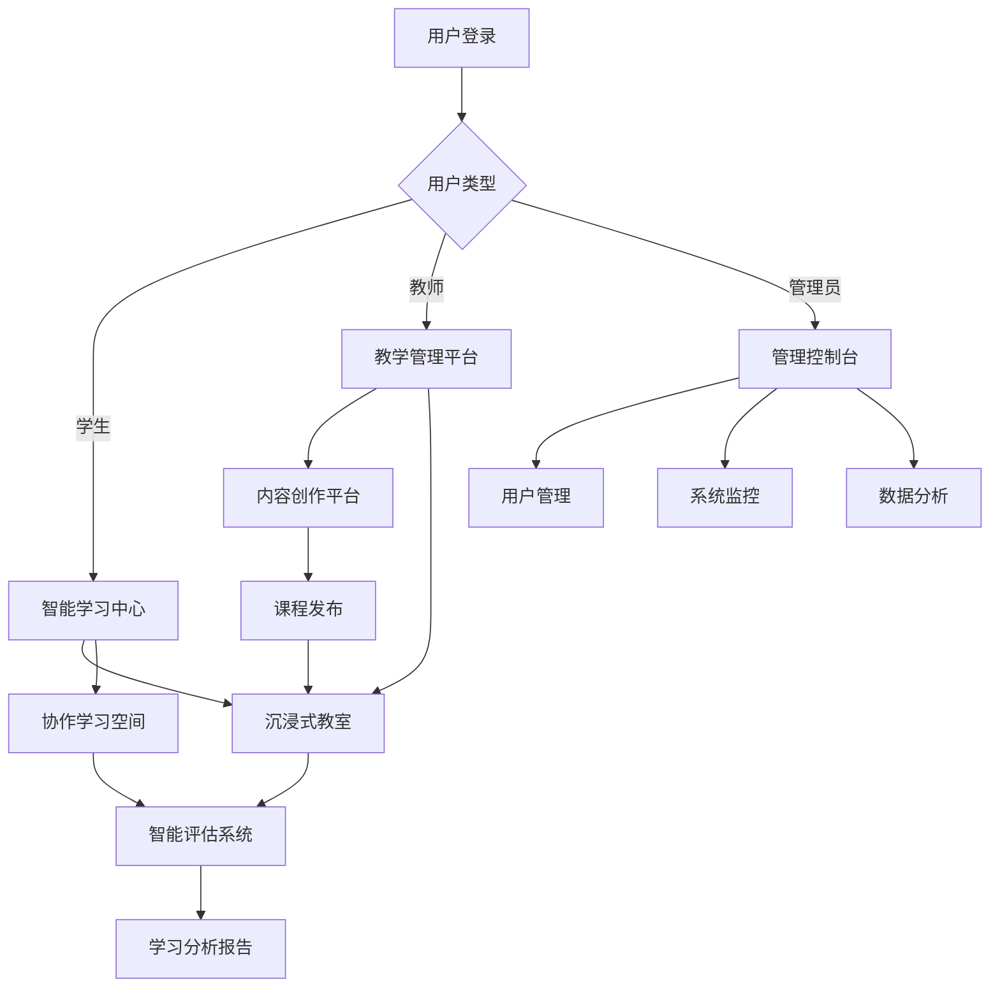

# 全息智能教育云(HIEC)产品需求文档

## 1. 产品概述

全息智能教育云(Holographic Intelligent Education Cloud, HIEC)是一个基于AI+沉浸式技术的下一代教育平台，通过五层分层架构设计，提供全息显示、AR/VR、Web多模态交互的智能教育解决方案。

该平台旨在解决传统教育中缺乏沉浸感、个性化不足、交互体验单一等问题，为学习者提供更加直观、高效、个性化的学习体验，同时为教育机构提供完整的数字化教学管理工具。

目标市场价值：预计在未来5年内，全球沉浸式教育市场将达到1000亿美元规模，HIEC致力于成为该领域的技术领导者。

## 2. 核心功能

### 2.1 用户角色

| 角色 | 注册方式 | 核心权限 |
|------|----------|----------|
| 学生用户 | 邮箱注册或机构邀请 | 访问学习内容、参与课程、查看学习进度、使用AI助手 |
| 教师用户 | 机构认证注册 | 创建课程、管理学生、发布内容、查看教学分析、使用教学工具 |
| 管理员 | 系统分配权限 | 用户管理、系统配置、数据分析、平台监控 |
| 机构管理员 | 机构授权注册 | 机构用户管理、课程审核、数据统计、资源分配 |

### 2.2 功能模块

我们的全息智能教育云包含以下核心页面：

1. **智能学习中心**：个性化学习路径、AI推荐内容、学习进度跟踪
2. **沉浸式教室**：全息/AR/VR教学环境、实时互动、多人协作
3. **内容创作平台**：3D内容编辑、课程制作、资源管理
4. **智能评估系统**：自适应测评、学习分析、能力诊断
5. **协作学习空间**：团队项目、讨论区、知识分享
6. **管理控制台**：用户管理、系统监控、数据分析

### 2.3 页面详情

| 页面名称 | 模块名称 | 功能描述 |
|----------|----------|----------|
| 智能学习中心 | 个性化推荐引擎 | 基于AI分析学习行为，推荐适合的学习内容和路径 |
| 智能学习中心 | 学习进度跟踪 | 实时显示学习进度、成就徽章、学习统计数据 |
| 智能学习中心 | 知识图谱导航 | 可视化知识结构，支持概念间关联浏览 |
| 沉浸式教室 | 全息显示系统 | 8K分辨率全息投影，支持3D模型、虚拟实验 |
| 沉浸式教室 | AR/VR交互 | 支持多种VR设备，手势识别、眼动追踪 |
| 沉浸式教室 | 实时协作 | 多人同步学习、语音交流、共享白板 |
| 内容创作平台 | 3D内容编辑器 | 拖拽式3D场景构建、物理仿真、动画制作 |
| 内容创作平台 | 课程制作工具 | 模板化课程创建、多媒体集成、交互设计 |
| 内容创作平台 | 资源库管理 | 3D模型库、纹理库、音频库、视频库 |
| 智能评估系统 | 自适应测评 | 根据学习能力动态调整题目难度和类型 |
| 智能评估系统 | 学习分析 | 多维度学习数据分析、学习行为预测 |
| 智能评估系统 | 能力诊断 | 知识掌握度评估、学习风格识别 |
| 协作学习空间 | 团队项目管理 | 项目创建、任务分配、进度跟踪、成果展示 |
| 协作学习空间 | 智能讨论区 | AI主持讨论、观点聚类、知识问答 |
| 管理控制台 | 用户管理系统 | 用户注册审核、权限分配、行为监控 |
| 管理控制台 | 系统监控 | 性能监控、资源使用统计、故障预警 |

## 3. 核心流程

### 学生学习流程
用户登录系统 → 查看个性化推荐 → 选择学习内容 → 进入沉浸式学习环境 → 完成学习任务 → 接受智能评估 → 获得学习反馈 → 更新学习路径

### 教师教学流程
教师登录 → 创建/选择课程 → 设计教学内容 → 开启虚拟教室 → 实时教学互动 → 布置作业评估 → 查看学习分析 → 调整教学策略

### 管理员管理流程
管理员登录 → 查看系统概况 → 用户管理操作 → 内容审核管理 → 系统配置调整 → 数据分析报告 → 性能优化决策

## 4. 用户界面设计

### 4.1 设计风格

- **主色调**：深空蓝(#0B1426)、科技紫(#6366F1)、青绿渐变(#10B981)
- **辅助色**：金属银(#E5E7EB)、警告橙(#F59E0B)、成功绿(#059669)
- **按钮风格**：圆角渐变按钮，支持悬停发光效果和点击反馈
- **字体**：主字体 Inter/思源黑体，代码字体 JetBrains Mono，字号16px-24px
- **布局风格**：卡片式设计，网格布局，顶部导航+侧边栏结构
- **图标风格**：线性图标配合填充图标，支持动画效果，科技感几何图形

### 4.2 页面设计概览

| 页面名称 | 模块名称 | UI元素 |
|----------|----------|--------|
| 智能学习中心 | 个性化推荐区域 | 卡片式布局，渐变背景，进度环形图，悬停动画效果 |
| 智能学习中心 | 学习路径导航 | 时间轴设计，节点高亮，完成状态标识，流畅过渡动画 |
| 沉浸式教室 | 3D视窗区域 | 全屏沉浸式界面，浮动控制面板，半透明UI覆盖层 |
| 沉浸式教室 | 交互工具栏 | 底部固定工具栏，图标按钮，快捷操作手势提示 |
| 内容创作平台 | 编辑器界面 | 分栏布局，拖拽组件库，属性面板，实时预览窗口 |
| 智能评估系统 | 测评界面 | 简洁问答布局，进度指示器，即时反馈动画 |
| 管理控制台 | 数据仪表板 | 网格化图表布局，实时数据更新，交互式图表组件 |

### 4.3 响应式设计

产品采用桌面优先设计，同时支持移动端自适应。针对VR/AR设备优化了触控交互，支持手势操作和语音控制。在不同设备上保持一致的用户体验和视觉风格。