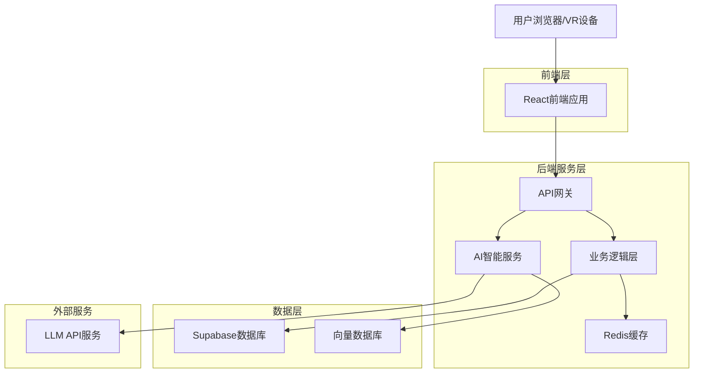
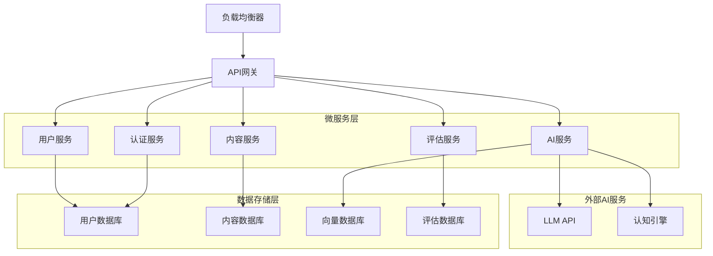
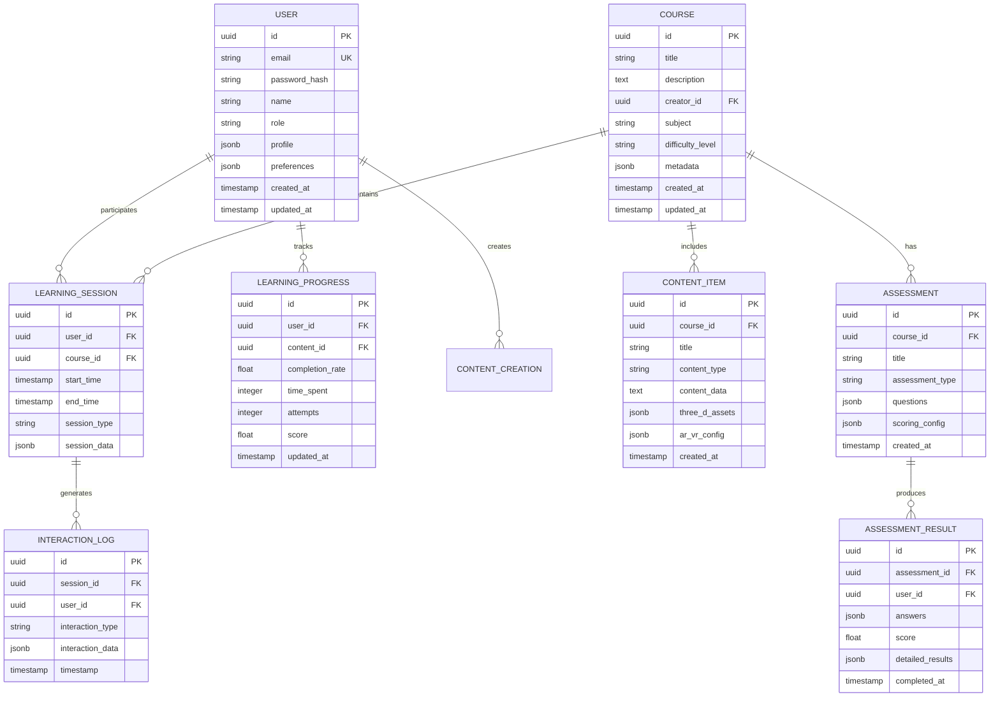

# 全息智能教育云(HIEC)技术架构文档

## 1. 架构设计



## 2. 技术描述

* **前端**: React\@18 + TypeScript + Three.js + WebXR + TailwindCSS + Vite

* **后端**: Node.js + Express\@4 + TypeScript

* **数据库**: Supabase (PostgreSQL) + Redis + Pinecone (向量数据库)

* **AI服务**: OpenAI GPT-4 + Claude + 自研认知引擎

* **实时通信**: WebSocket + WebRTC

* **3D渲染**: Three.js + WebGL2 + WebGPU

* **部署**: Docker + Kubernetes + Vercel

## 3. 路由定义

| 路由             | 用途              |
| -------------- | --------------- |
| /              | 首页，展示平台概览和快速入口  |
| /dashboard     | 用户仪表板，个性化学习中心   |
| /classroom/:id | 沉浸式教室，支持VR/AR模式 |
| /create        | 内容创作平台，3D内容编辑器  |
| /assessment    | 智能评估系统，自适应测评    |
| /collaborate   | 协作学习空间，团队项目管理   |
| /profile       | 用户个人资料和学习统计     |
| /admin         | 管理控制台，系统管理功能    |
| /login         | 用户登录页面          |
| /register      | 用户注册页面          |

## 4. API定义

### 4.1 核心API

#### 用户认证相关

```
POST /api/auth/login
```

请求参数:

| 参数名      | 参数类型   | 是否必需 | 描述   |
| -------- | ------ | ---- | ---- |
| email    | string | true | 用户邮箱 |
| password | string | true | 用户密码 |

响应参数:

| 参数名     | 参数类型    | 描述      |
| ------- | ------- | ------- |
| success | boolean | 登录是否成功  |
| token   | string  | JWT访问令牌 |
| user    | object  | 用户基本信息  |

示例:

```json
{
  "email": "student@example.com",
  "password": "securePassword123"
}
```

#### 学习内容管理

```
GET /api/content/recommendations
```

请求参数:

| 参数名        | 参数类型   | 是否必需  | 描述   |
| ---------- | ------ | ----- | ---- |
| userId     | string | true  | 用户ID |
| subject    | string | false | 学科筛选 |
| difficulty | string | false | 难度级别 |

响应参数:

| 参数名             | 参数类型   | 描述     |
| --------------- | ------ | ------ |
| recommendations | array  | 推荐内容列表 |
| totalCount      | number | 总数量    |

#### AI智能服务

```
POST /api/ai/chat
```

请求参数:

| 参数名       | 参数类型   | 是否必需  | 描述    |
| --------- | ------ | ----- | ----- |
| message   | string | true  | 用户消息  |
| context   | object | false | 学习上下文 |
| sessionId | string | true  | 会话ID  |

响应参数:

| 参数名         | 参数类型   | 描述     |
| ----------- | ------ | ------ |
| response    | string | AI回复内容 |
| suggestions | array  | 相关建议   |
| confidence  | number | 置信度分数  |

## 5. 服务器架构图



## 6. 数据模型

### 6.1 数据模型定义



### 6.2 数据定义语言

#### 用户表 (users)

```sql
-- 创建用户表
CREATE TABLE users (
    id UUID PRIMARY KEY DEFAULT gen_random_uuid(),
    email VARCHAR(255) UNIQUE NOT NULL,
    password_hash VARCHAR(255) NOT NULL,
    name VARCHAR(100) NOT NULL,
    role VARCHAR(20) DEFAULT 'student' CHECK (role IN ('student', 'teacher', 'admin', 'institution_admin')),
    profile JSONB DEFAULT '{}',
    preferences JSONB DEFAULT '{}',
    created_at TIMESTAMP WITH TIME ZONE DEFAULT NOW(),
    updated_at TIMESTAMP WITH TIME ZONE DEFAULT NOW()
);

-- 创建索引
CREATE INDEX idx_users_email ON users(email);
CREATE INDEX idx_users_role ON users(role);
CREATE INDEX idx_users_created_at ON users(created_at DESC);
```

#### 课程表 (courses)

```sql
-- 创建课程表
CREATE TABLE courses (
    id UUID PRIMARY KEY DEFAULT gen_random_uuid(),
    title VARCHAR(200) NOT NULL,
    description TEXT,
    creator_id UUID REFERENCES users(id),
    subject VARCHAR(50) NOT NULL,
    difficulty_level VARCHAR(20) DEFAULT 'beginner' CHECK (difficulty_level IN ('beginner', 'intermediate', 'advanced')),
    metadata JSONB DEFAULT '{}',
    created_at TIMESTAMP WITH TIME ZONE DEFAULT NOW(),
    updated_at TIMESTAMP WITH TIME ZONE DEFAULT NOW()
);

-- 创建索引
CREATE INDEX idx_courses_creator_id ON courses(creator_id);
CREATE INDEX idx_courses_subject ON courses(subject);
CREATE INDEX idx_courses_difficulty ON courses(difficulty_level);
```

#### 学习进度表 (learning\_progress)

```sql
-- 创建学习进度表
CREATE TABLE learning_progress (
    id UUID PRIMARY KEY DEFAULT gen_random_uuid(),
    user_id UUID REFERENCES users(id),
    content_id UUID NOT NULL,
    completion_rate FLOAT DEFAULT 0.0 CHECK (completion_rate >= 0.0 AND completion_rate <= 1.0),
    time_spent INTEGER DEFAULT 0,
    attempts INTEGER DEFAULT 0,
    score FLOAT DEFAULT 0.0,
    updated_at TIMESTAMP WITH TIME ZONE DEFAULT NOW()
);

-- 创建索引
CREATE INDEX idx_learning_progress_user_id ON learning_progress(user_id);
CREATE INDEX idx_learning_progress_content_id ON learning_progress(content_id);
CREATE INDEX idx_learning_progress_updated_at ON learning_progress(updated_at DESC);

-- 创建唯一约束
CREATE UNIQUE INDEX idx_learning_progress_user_content ON learning_progress(user_id, content_id);
```

#### 交互日志表 (interaction\_logs)

```sql
-- 创建交互日志表
CREATE TABLE interaction_logs (
    id UUID PRIMARY KEY DEFAULT gen_random_uuid(),
    session_id UUID NOT NULL,
    user_id UUID REFERENCES users(id),
    interaction_type VARCHAR(50) NOT NULL,
    interaction_data JSONB DEFAULT '{}',
    timestamp TIMESTAMP WITH TIME ZONE DEFAULT NOW()
);

-- 创建索引
CREATE INDEX idx_interaction_logs_session_id ON interaction_logs(session_id);
CREATE INDEX idx_interaction_logs_user_id ON interaction_logs(user_id);
CREATE INDEX idx_interaction_logs_timestamp ON interaction_logs(timestamp DESC);
CREATE INDEX idx_interaction_logs_type ON interaction_logs(interaction_type);
```

#### 初始化数据

```sql
-- 插入示例用户数据
INSERT INTO users (email, password_hash, name, role, profile) VALUES
('admin@hiec.com', '$2b$10$example_hash', '系统管理员', 'admin', '{"avatar": "/avatars/admin.png"}'),
('teacher@hiec.com', '$2b$10$example_hash', '张教授', 'teacher', '{"department": "计算机科学", "expertise": ["AI", "VR"]}'),
('student@hiec.com', '$2b$10$example_hash', '李同学', 'student', '{"grade": "大三", "major": "软件工程"}');

-- 插入示例课程数据
INSERT INTO courses (title, description, creator_id, subject, difficulty_level) VALUES
('AI基础与应用', '人工智能基础概念和实际应用案例', (SELECT id FROM users WHERE email = 'teacher@hiec.com'), 'Computer Science', 'beginner'),
('虚拟现实开发', 'VR应用开发技术和3D建模', (SELECT id FROM users WHERE email = 'teacher@hiec.com'), 'Computer Science', 'intermediate');
```

#### 权限设置

```sql
-- 为匿名用户授予基本读取权限
GRANT SELECT ON users TO anon;
GRANT SELECT ON courses TO anon;

-- 为认证用户授予完整权限
GRANT ALL PRIVILEGES ON users TO authenticated;
GRANT ALL PRIVILEGES ON courses TO authenticated;
GRANT ALL PRIVILEGES ON learning_progress TO authenticated;
GRANT ALL PRIVILEGES ON interaction_logs TO authenticated;
```

