# 全息智能教育云网页设计逻辑框图文档

## 1. 网站整体架构流程图

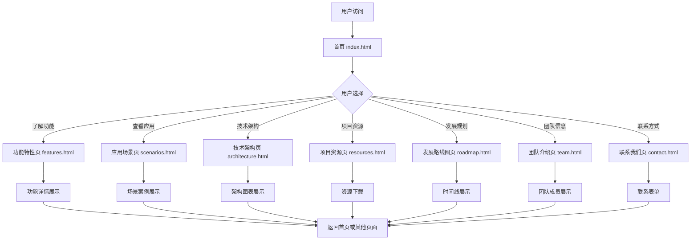

## 2. 页面间逻辑关系图

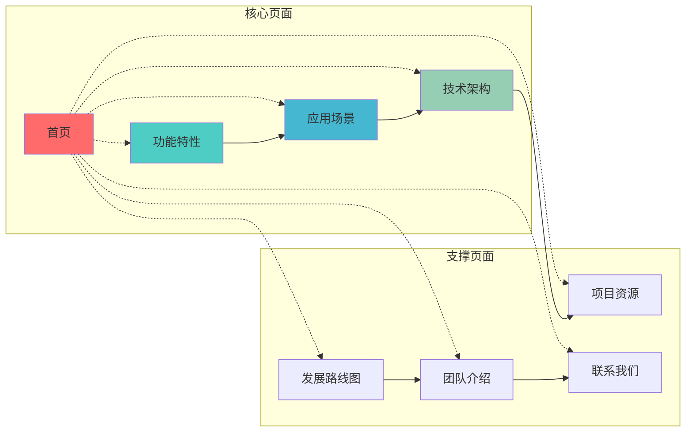

## 3. 用户交互流程图

### 3.1 首页用户交互流程

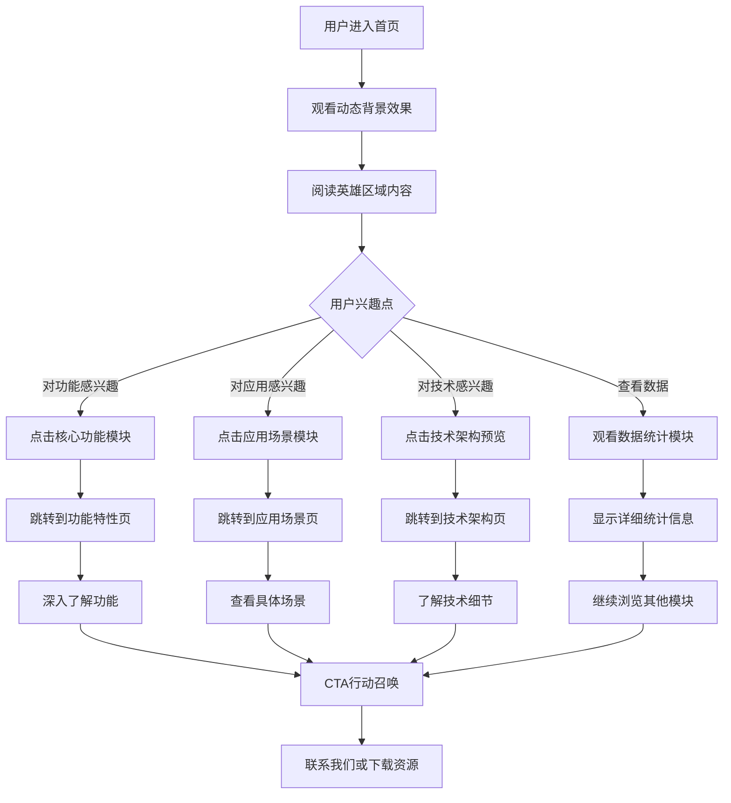

### 3.2 功能页面交互流程

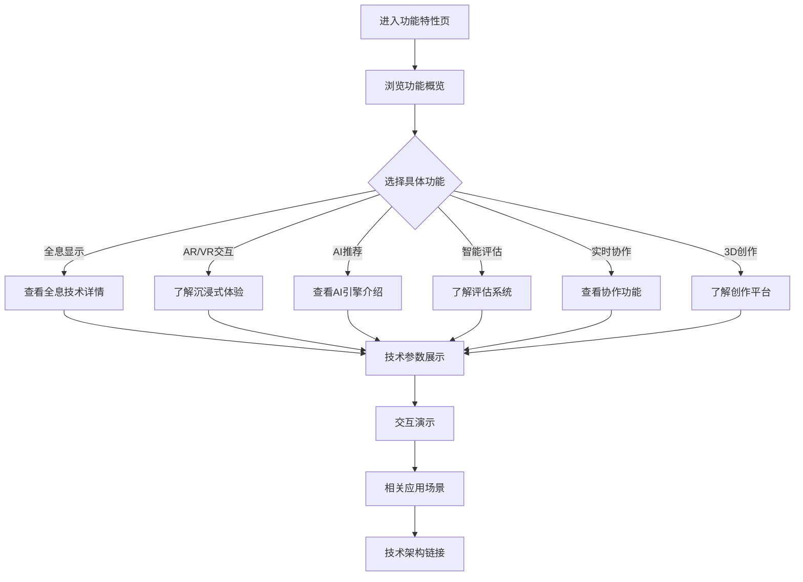

## 4. 设计系统组件关系图

### 4.1 UI组件层次结构

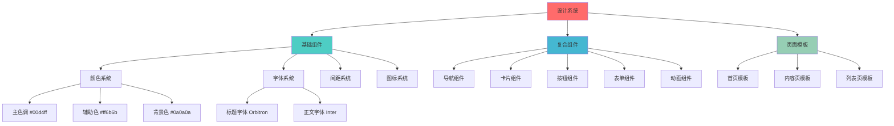

### 4.2 交互效果组件关系

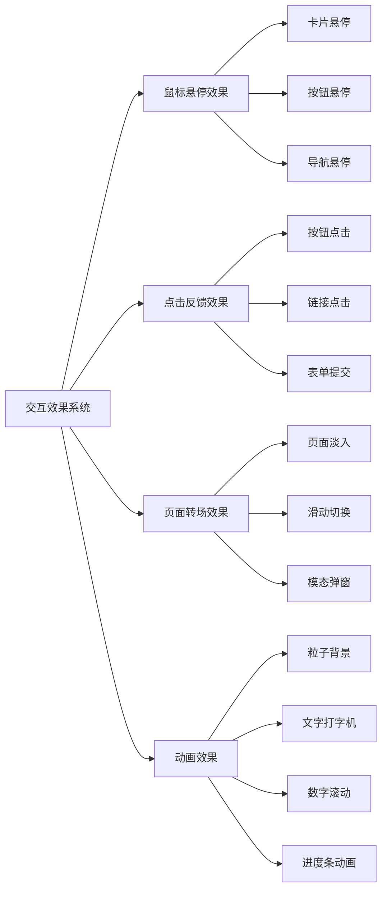

## 5. 数据流向图

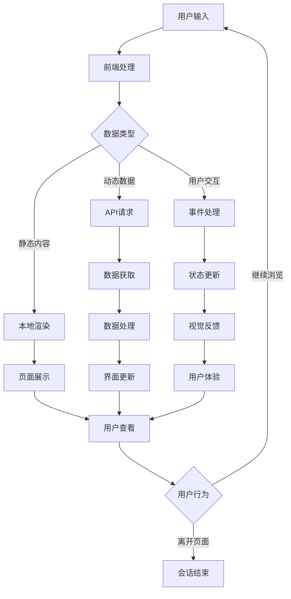

## 6. 响应式设计逻辑图

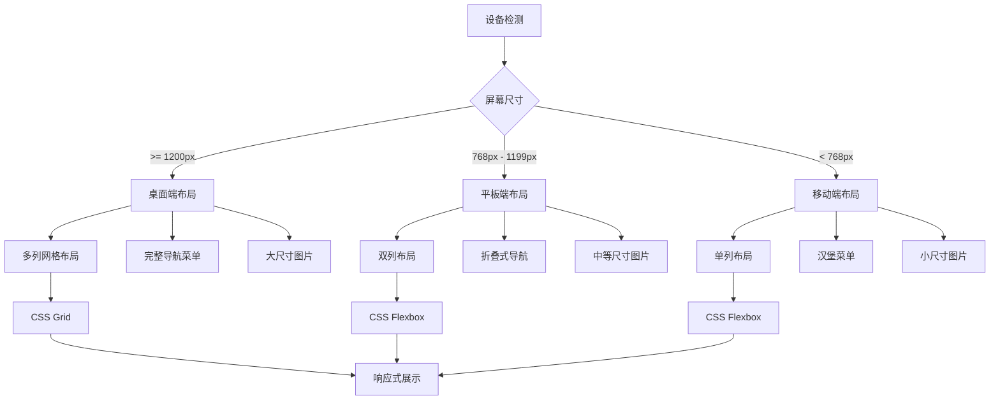

## 7. 性能优化流程图

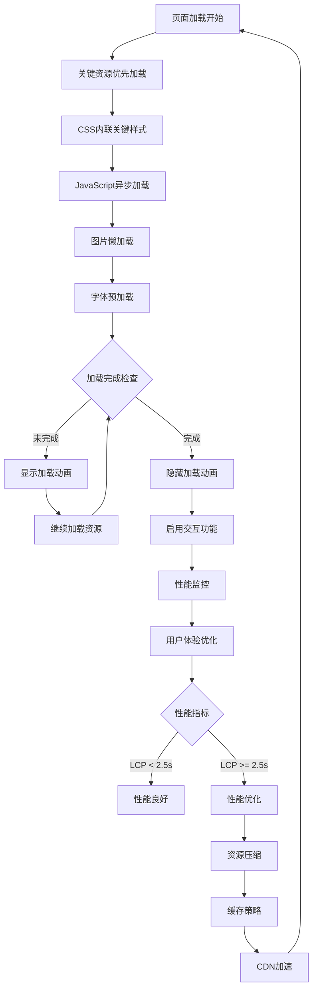

## 8. 内容管理逻辑图

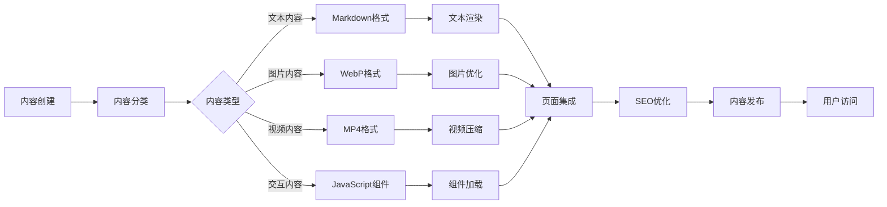

## 9. 错误处理流程图

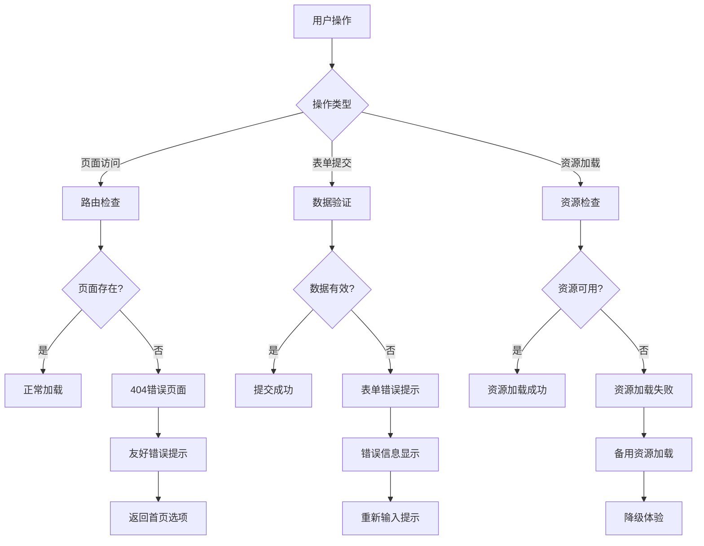

## 10. 总结

本逻辑框图文档通过多个维度的流程图和关系图，清晰展示了全息智能教育云网站的：

- **架构逻辑**：从用户访问到页面跳转的完整流程
- **交互逻辑**：用户在各个页面的操作路径和反馈机制
- **设计逻辑**：组件系统的层次结构和关系
- **技术逻辑**：数据流向、响应式设计和性能优化策略
- **内容逻辑**：内容管理和错误处理的完整流程

这些逻辑框图为网站的开发、维护和优化提供了清晰的指导方向，确保整个系统的逻辑性和一致性。